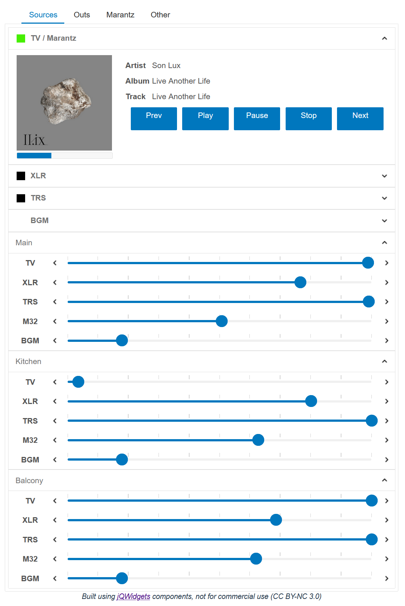

**THIS PROJECT RELIES ON BEHAVIOR THAT IS NOT DOCUMENTED OR SUPPORTED BY QSC AND SHOULD NOT BE USED IN PRODUCTION ENVIRONMENTS**

# Vue UCI
This is a working example of a fully native webapp carrying out direct UI presentation and control of a QSC Q-SYS Core.
It uses the Vue library, Vuex datastore, and [jQWidgets](https://www.jqwidgets.com/) components to quickly build a fully
customizable, responsive, and cross platform UI. 

## Why?
* Web UCIs sorta suck (currently)
  * CSS is only partially supported and poorly documented
  * Layout is static and constrained by the capabilities of legacy hardware UCIs
  * The UI itself is rendered as an image, preventing any accessibility aides from working
* There is already a very robust ecosystem for dynamic data in webapps
* I don't personally agree with QSC that the best first step to web UIs was to build a lipstick-on-a-pig port of native
UCIs instead of empowering the users that want to/can leverage existing tools to build performant custom interfaces via 
a library or something, so I built that for myself.

## Does it work?
Yes. I use it to control the Core 110 running my home theater system. (This repo is that UI as an example)

## Can I use it?
Probably only as an experiment. You'll have to make your own UI by extending to or adding base components. This also
uses a bunch of things that QSC does not to my knowledge document or support. I found them by watching what web UCIs do,
so they're _probably_ stable, but that's not at all guaranteed.

## Examples
### Main Page


### Reactive Layout


# Running locally:
The Core doesn't set the CORS attribute on a page that this needs to work, so there's a companion HTTP proxy/server to 
this project [here](https://github.com/zjstraus/QSYS-CORS-Bridge). It pulls double duty as a CORS proxy and server for
the UI files.

1. (This repo) Install the dependencies for the UI and build it
    ```shell script
    npm install
    npm run build
    ```
2. [Download the latest release of the server for your platform](https://github.com/zjstraus/QSYS-CORS-Bridge/releases/)
and extract the files.
3. Copy the contents of the `dist` directory created in step 1 to the `assets` folder of the server
4. Start the server, passing in the address of your target core on the command line
    ```shell script
    ./ucibridge -address="192.168.201.165"
    ```
5. Open the UI in a web browser (the server defaults to running on port 8080)

# Customizing/Expanding
You can base your own UIs on this framework, but you'll probably have to add new components to do whatever you want.

## QSYS Preperation
In your Design, expose any controls you want to use in your interface as Named Controls. They don't need to be on any
UCIs to work here, but there also won't be any conflicts between existing UCIs and these UIs if they both use the same
controls.

## Vue programming
Every Vue component needs to add whatever Named Control(s) it's mapped to to the Vuex store by dispatching the 
`addNamedControl` action with the name of the control. Once that's done it should be available in the store at 
`$store.state.controlData[{{Control Name}}]`. All the components I've made store their control name as a `namedControl`
prop but that's a convention, not a requirement. 

See the README in the store directory for more details on the inner workings of the store.
